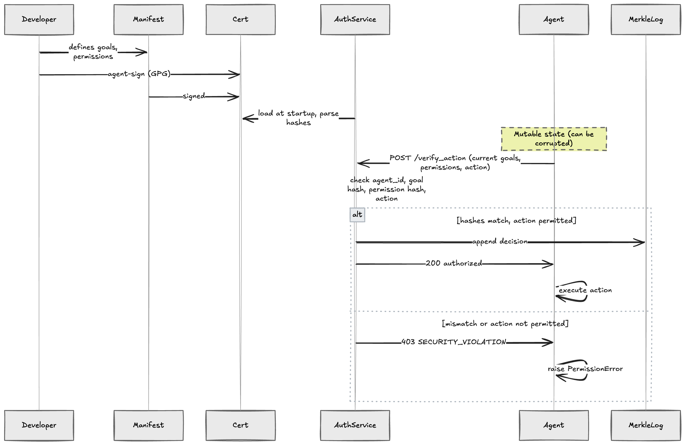

# Agent Goal Binding


`ai-safety` · `ai-agents` · `prompt-injection` · `goal-binding` · `cryptography` · `ed25519` · `pgp` · `authorization` · `flask` · `python` · `security-research` · `llm-security`

**POC:** Cryptographic goal-binding and authorization that blocks agent goal/permission corruption or tampering (nothing else). No general-purpose capabilities or external services are used.

This project demonstrates how to **pin an AI agent's goals and permissions**
using PGP-signed certificates and independent runtime verification. Even if
an attacker corrupts the agent's in-memory state via prompt injection, every
privileged action is validated against the original signed manifest. This is an experiment aimed at sparking discourse around the concept.

## Architecture


| Component | Path | Purpose |
|-----------|------|---------|
| **Agent** | `src/agent_goal_binding/agent.py` | Conversational agent with mutable runtime state |
| **Auth Service** | `src/agent_goal_binding/auth/service.py` | Independent Flask service that validates actions |
| **Verification** | `src/agent_goal_binding/auth/verification.py` | Pure-function hash comparison and certificate parsing |
| **Signing** | `src/agent_goal_binding/crypto/signing.py` | GPG clearsign tooling for manifests |
| **Manifest** | `config/agent_manifest.json` | Agent goals, permissions, and prohibited actions |

### Data flow



## Quickstart

```bash
# 1. Create a virtual environment and install
python -m venv .venv && source .venv/bin/activate
pip install -e ".[dev]"

# 2. Generate an Ed25519 GPG key (if you don't have one)
gpg --quick-generate-key "Matstalktech <contact@matstalktech.com>" ed25519

# 3. Sign the manifest
agent-sign config/agent_manifest.json <YOUR_KEY_ID>

# 4. Start the authorization service
agent-auth-server --cert config/agent_certificate.asc

# 5. Run the unit tests (no server needed)
pytest tests/test_verification.py -v

# 6. Run the integration / attack tests (server must be running)
pytest tests/test_attacks.py -v
```

## Project Structure

```
├── pyproject.toml                         # PEP 621 project config
├── config/
│   ├── agent_manifest.json                # Agent definition
│   └── developer_public_key.asc           # Public key for verification
├── src/agent_goal_binding/
│   ├── agent.py                           # SecureAgent class
│   ├── auth/
│   │   ├── service.py                     # Flask auth server
│   │   └── verification.py                # Pure verification logic
│   └── crypto/
│       └── signing.py                     # Manifest signing CLI
└── tests/
    ├── conftest.py                        # Shared fixtures
    ├── test_verification.py               # Unit tests (self-contained)
    └── test_attacks.py                    # Integration attack scenarios
```

## How It Works

1. A developer defines agent goals/permissions in `agent_manifest.json`
2. The manifest is **signed** with a GPG key → produces `agent_certificate.asc`
3. At runtime, the **auth service** loads the signed certificate and
   extracts SHA-256 hashes of the original goals and permissions
4. When the agent attempts a privileged action, it sends its *current*
   goals/permissions to the auth service
9. The service compares hashes — if they don't match, the action is **blocked**
   and a `SECURITY_VIOLATION` alert is raised
6. **Immutable Logging**: Every authorized decision is appended to a **Merkle Chain** (hash chain).
   - Each log entry is cryptographically linked to the previous one.
   - The chain is persisted to `agent_decision_log.json`.
   - The `/logs` endpoint retrieves the chain.
   - The `/verify_logs` endpoint re-calculates all hashes to prove integrity.
